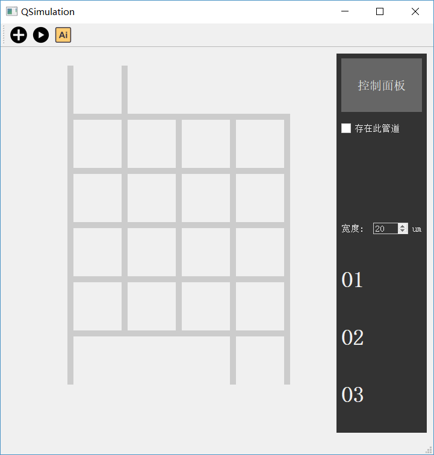
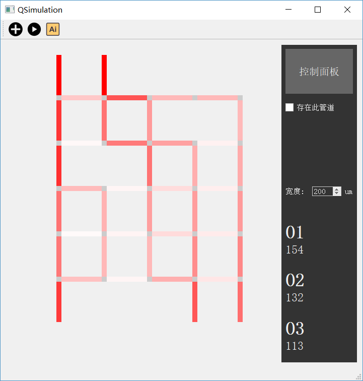
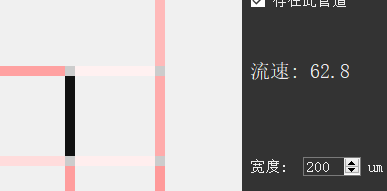
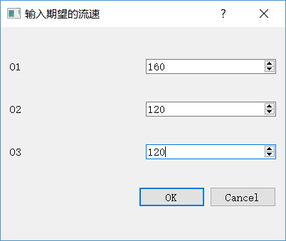

#QSimulation 的功能及其实现

计73 于是 2017011414

## 简介

QSimulation 是一个微流控生物芯片流体模拟的计算界面。提供了从 5x5 到 8x8 的微流控芯片的流速与浓度模拟的功能，有友好的操作体验。可以使用 QSimulation 轻松地增删管道、调整宽度，从管道标示的颜色中直观地获取浓度和流速信息。还能够根据输入的流速值自动调整芯片的结构。


## 功能

QSimulation 提供了两种模式：

- 可调整宽度模式。在这种模式下，可以计算得到管道的流速信息，也能够根据输入数据自动调整芯片结构。
- 可显示浓度模式。在这种模式下，可以计算得到每条管道的流速和浓度信息。但是宽度无法调整，也无法进行自动设计。

工具栏上的三个按钮功能分别为：

- 「新建」：新建一个芯片，输入其大小以及输入/输出管道的位置。输入/输出管道不可同列。选择一种模式。
- 「运行」：基于创建的芯片以及选择的模式，进行模拟运算。得到的结果在右侧「控制面板」显示。
- 「自动设计」：在「可调整宽度」模式下，输入三个输出管道期望的流速值，根据流速值和现有芯片结构调整芯片的管道宽度。

运行 QSimulation 后，选择「新建」按钮新建一个芯片。芯片的初始结构便会绘制在主窗口中，如图：



点击图中的管道，便可以进行选中，然后在右侧面板中调整**存在性**和**宽度**：


或者按下 `delete` 键也可以删除选中的管道。进行调整后，点击「运行」就可以运行模拟：



在宽度可调模式（图示）下，管道颜色的深浅表示流速的大小（越深流速越大）。右侧面板中显示三个流出管道的浓度。同时，点击选中某一个管道，也可以看到它的流速，与此同时也可以调整宽度和存在性：



在「可显示浓度」模式下，面板上也会显示三个输出管道的浓度，点击某一个管道也会将其浓度与流速一并显示。

在「可调整宽度」模式下，点击「自动设计」按钮，输入期望的流速：



点击「OK」便可执行自动调整：


只要数秒钟便可以得到答案（如果数据与原结果接近，可能在1 ~ 3秒；如果相差较大，可能在5 ~ 10秒）。可能与期望值存在微小差异。

此外，可通过上下左右键选中管道，十分便捷。

## GUI 的部分实现细节

管道是通过继承 `QPushButton` 类实现的，使其具有了可选中、可被删除、可调整宽度的特性。选中与删除时按钮的样式会发生变化，这是通过调整样式表实现的。管道的连接处是直接绘制的，不能响应事件。所有管道置于一继承自 `QWidget` 的容器中。此容器高度封装，便于外界进行调整宽度以及存在性的操作。

管道的显示大小等值是在 `utili.h` 中以宏的形式定义的：

```c++
#define CONNECTOR_SIZE 10
#define PIPE_LENGTH 80
#define INTERVAL (CONNECTOR_SIZE + PIPE_LENGTH)
#define START_POS 100
#define DEFAULT_WIDTH 200
```

在需要用到上述值的地方会引用该头文件。这种灵活的设计（不是写死在各个代码文件中）使得调整视觉的时候十分方便。另外 `utili.h` 中也封装了一些全局会用到的枚举。

## 算法概述

浓度的计算是基于拓扑排序实现的。

调整芯片设计的功能，是通过模拟退火算法实现的。用户输入的期望值与当前值的差为势能的初始值，算法通过随机调整宽度（`core.h` 中的 `neighbour` 函数）以及一定几率的势能上升与下降，最终尽可能达到势能最低点。考虑到模拟退火算法的随机性，本程序使用三次模拟退火使结果更加精确。