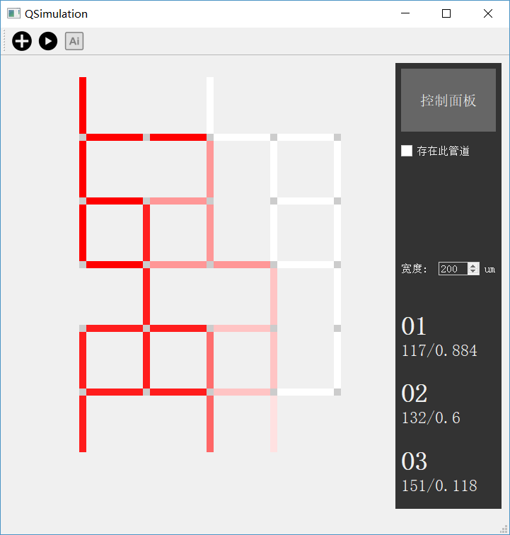

# QSimulation 的功能及其实现

## 简介

QSimulation 是一个微流控生物芯片流体模拟的计算界面。提供了从 5x5 到 8x8 的微流控芯片的流速与浓度模拟的功能，有友好的操作体验。可以使用 QSimulation 轻松地增删管道、调整宽度，从管道标示的颜色中直观地获取浓度和流速信息。还能够根据输入的流速值自动调整芯片的结构。

## 功能

工具栏上的三个按钮功能分别为：

- 「新建」：新建一个芯片，输入其大小以及输入/输出管道的位置。输入/输出管道不可同列。选择一种模式：
  - 可调整宽度模式。在这种模式下，可以计算得到管道的流速信息，也能够根据输入数据自动调整芯片结构。
  - 可显示浓度模式。在这种模式下，可以计算得到每条管道的流速和浓度信息。但是宽度无法调整，也无法进行自动设计。
- 「运行」：基于创建的芯片以及选择的模式，进行模拟运算。得到的结果在右侧「控制面板」显示。
- 「自动设计」：在「可调整宽度」模式下，输入三个输出管道期望的流速值，根据流速值和现有芯片结构调整芯片的管道宽度。

只要数秒钟便可以得到答案（如果数据与原结果接近，可能在1 ~ 3秒；如果相差较大，可能在5 ~ 10秒）。可能与期望值存在微小差异。

此外，可通过上下左右键选中管道、`delete` 键删除管道，十分便捷。

## 算法概述

浓度的计算是基于拓扑排序实现的。调整芯片设计的功能，是通过模拟退火算法实现的。
